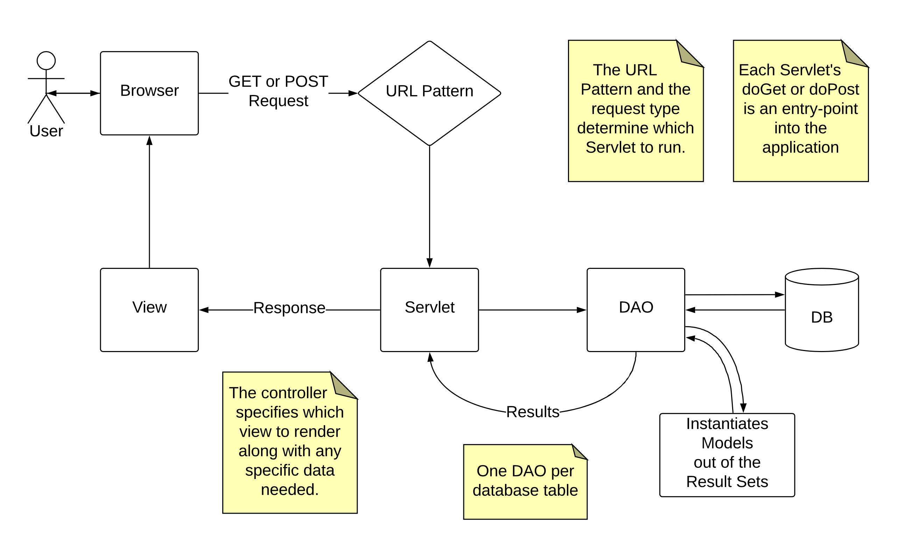

# Model View Controller
MVC says that we should separate our applications into three distinct parts: Models, Views and Controllers.

    - Models are responsible for the representation of data in our application. We'll use Java beans (more on this in a coming section) to represent our data.
    - Views are the piece of the application that handle the presentation to the user. JSP files are the view layer in our AdLister application.
    - Controllers are where the logic happens, and where we respond to user actions. Servlets will serve this purpose in our application.

 	                Model 	    View 	    Controller
Responsible for: 	Data 	Presentation 	Logic
In our project: 	Beans 	JSPs 	        Servlets

    DAO = Data Access Object is a object/interface, which is used to access data from database of data storage.

## Servlets and JSPs
Servlets should only handle logic (meaning no HTML inside of strings inside of servlets), and our JSPs should just deal with presentation (meaning no arbitrary java inside of <% %>). To enable this, we need to pass data from a servlet to a JSP file. We will do so through two primary methods on the request object, setAttribute and getRequestDispatcher.

### Controller: HelloServlet.java

    protected void doGet(HttpServletRequest request, HttpServletResponse response) {
    String name = request.getParameter("name");
    // if the name is null, it means that "name" was not present in the query
    // string, and here we'll provide a default value
    if (name == null) {
        name = "World!";
    } else if (name.equals("bgates")) {
        response.sendRedirect("https://microsoft.com");
        return;
    }
    // pass the value of the name variable to the view, and send the request
    // forward to the hello.jsp file
    request.setAttribute("name", name);
    request.getRequestDispatcher("/hello.jsp").forward(request, response);
    }

### View: hello.jsp

    <h1>Hello there, ${name}!</h1>

While this example is small in scope, it illustrates the idea of separating the logic from the presentation. The two methods mentioned earlier on the request object are key in making this happen:

#### setAttribute

    request.setAttribute("variableName", value);

This allows us to make a value available in the JSP. The first argument to the method is a string, in the above example, "name", that defines the variable name in the JSP. The second argument is the value for that variable. If, for example, we wrote the following code in our servlet:

    request.setAttribute("theNumber", 42);

In our JSP we would be able to reference a variable named theNumber, and we could write:

    <h1>The number is ${theNumber}.</h1>

This gives us an end result of:

    <h1>The number is 42.</h1>

- See GuessServlet or PickColorServlet in Adlister

#### getRequestDispatcher

    request.getRequestDispatcher("/path/to/file.jsp").forward(request, response);

This method allows us to pass the flow of control from our servlet to a JSP. The string that is passed to the method should be the path to the JSP file relative to the webapp directory.

This line is usually the last line in a doGet or doPost method. Any logic or attribute setting is performed before this method is called.

#### Processing forms
https://www.tutorialspoint.com/jsp/jsp_form_processing.htm

1. getParameter() − You call request.getParameter() method to get the value of a form parameter. Usually tied to the 'name' attribute of the form.
2. getParameterValues() − Call this method if the parameter appears more than once and returns multiple values, for example checkbox.
3. getParameterNames() − Call this method if you want a complete list of all parameters in the current request.
4. getInputStream() − Call this method to read binary data stream coming from the client.

#### See Adlister Branch Notes:
- servlets-with-jsps: pickcolor
- servlets-with-jsps: guess -> doGet vs doPost, redirects, getParameter, setAttribute

## JavaBeans

The M in MVC says that the data an application handles and its representation should also be a separate concern. We will use beans to represent the entities in our application. 

    An entity is a singular, identifiable object within the problem space our application is operating in. 
Usually each entity is represented by a database table. If we were building a web application that interacted with the employees database we explored in the previous module, we might have the following entities:

    Department
    Employee
    Manager
    Salary
    Title
As each one of the above is a discrete object. Notice that tables like dept_emp or dept_manager are not in the above list. While they are necessary to relate two entities together, they are not themselves entities, as they exist just to relate two entities together.

In order to represent entities in our Java code, we will use beans. A JavaBean, or bean, is a Java class that:

1. provides a zero-argument constructor
2. has getters and setters for all instance variables
3. implements the Serializable or Externalizable interface
   1. There are no methods to implement with these interfaces, they just are a programmatic way of saying that the class has a string representation (it can be serialized). ↩

You can think of a bean as a Java class that just represents data, meaning the class doesn't perform any complex logic or control flow, rather, it just serves as a way to group properties. Many Java libraries are built around beans, meaning we can leverage many existing libraries by writing our classes as beans. We will write any model classes (classes that represent our entities, which represent information from the database) as beans.

Each model class corresponds to the structure of the underlying database table, and instances of the class represent rows from the underlying database table.

Recall the structure of the employees table from our sample database:

    Field      | Type
    -----------|---------------
    emp_no     | int(11)
    birth_date | date
    first_name  | varchar(14)
    last_name  | varchar(16)
    gender     | enum('M','F')
    hire_date  | date

Here is an example of what a model for the Employee entity might look like:

    public class Employee implements Serializable {
        private long empNo;
        private String firstName;
        private String lastName;
        private char gender;
        private Date birthDate;
        private Date hireDate;
    
        public Employee() {  }

    // getters and setters
    }
Notice that the properties in this class match up with the columns of the employees table in the database. Java and MySQL don't have the exact same data types, but we can still provide accurate information about the type of each property in Java.

NOTE: In our models, we follow Java naming conventions for our class fields, not the snake_case convection that we follow with database tables. This means property names should be camelCase; for example, emp_no becomes empNo, and first_name becomes firstName, and so on.

