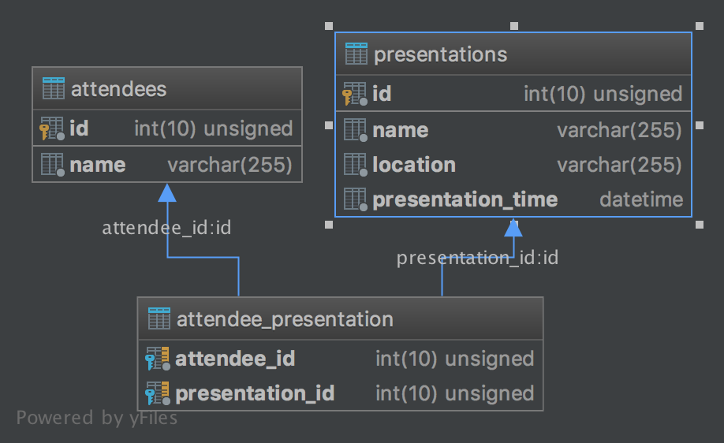

# RELATIONAL database management system (RDMS)
Using MySQL to manage relationships across multiple databases.

## Indexes (Indices)

Indexes are used to find rows with specific column values quickly. Without an index, MySQL must begin with the first row and then read through the entire table to find the relevant rows. The larger the table, the more this costs. If the table has an index for the columns in question, MySQL can quickly determine the position to seek to in the middle of the data file without having to look at all the data. If a table has 1,000 rows, this is at least 100 times faster than reading sequentially. If you need to access most of the rows, it is faster to read sequentially, because this minimizes disk seeks.
        
    https://dev.mysql.com/doc/refman/8.0/en/mysql-indexes.html

### Primary Keys
Unique identifier for each row, much like a row number in a spreadsheet. This will give us the ability to easily reference the data in that row, and MySQL will make sure there are never duplicates.

Typically we add the PRIMARY KEY index on our id column, along with AUTO_INCREMENT.

        CREATE TABLE quotes (
        id INT NOT NULL AUTO_INCREMENT,
        author VARCHAR(50) NOT NULL,
        content VARCHAR(240) NOT NULL,
        PRIMARY KEY (id)
        );
This table will now have a column named id that will increase automatically, starting at 1. Because we set it as a primary key, the id column will never have a duplicate, and performing queries on the id will be very fast.

### Unique
UNIQUE indexes work very similar to primary keys; however, unique indexes are not limited to 1 per table. If we need to add a constraint on a column to make sure there are not duplicates, like email addresses in a user database, then the UNIQUE constraint can be added to the column.
#### ALTER
We can use the ALTER statement to update a table.

        ALTER TABLE quotes
        ADD UNIQUE (content);
### Foreign Keys
If a table has many columns, and you query different combinations of columns, it might be efficient to split the less-frequently used data into separate tables with a few columns each, and relate them back to the main table by duplicating the numeric ID column from the main table. That way, each small table can have a primary key for fast lookups of its data, and you can query just the set of columns that you need using a join operation.

    TL;DR: Use foreign keys to relate tables that will be used in joins
### Multiple-Column Indexes
MySQL can create composite indexes (that is, indexes on multiple columns). An index may consist of up to 16 columns.

    CREATE TABLE authors (
    id INT NOT NULL AUTO_INCREMENT,
    first_name VARCHAR(100) NOT NULL,
    last_name VARCHAR(100) NOT NULL,
    PRIMARY KEY (id),
    UNIQUE (first_name, last_name)
    );
This creates a new table named authors, and the unique key constraint is on the combined values of first_name and last_name.

## Exercise

1. USE your codeup_test_db database.
2. Add an index to make sure all album names combined with the artist are unique. Try to add duplicates to test the constraint.

    
    ALTER TABLE albums 
    ADD UNIQUE unique_album_and_artist (artist, name);
    DESCRIBE albums;

## JOINS

MySQL allows us to JOIN tables, usually based on a foreign key relationship. The process of joining will allow us to obtain query results from more than one table in a single query. There are different types of joins, and those different types give us a lot of flexibility in the actual query results.
The syntax for joining tables is simply using JOIN to describe the table that will be joining the query, and ON to describe the relationship.

    SELECT columns
    FROM table_a as A
    JOIN table_b as B ON A.id = B.fk_id;
Notice that tables can be aliased by using table_name as alias. The records from table_a and table_b will be joined based on the relationship provided between the column id in table_a and the column fk_id in table_b.

It is also helpful to know that the first table mentioned, table_a in the above example, is referred to as the left table of the join. The joined/second table mentioned, table_b in the above example, is referred to as the right table of the join.

#### PERSON TABLE
PersonID 	LastName 	FirstName 	Age
1 	            Hansen 	    Ola 	30
2 	            Svendson 	Tove 	23
3 	            Pettersen 	Kari 	20

#### ORDER TABLE
OrderID 	OrderNumber 	PersonID
1 	            77895 	        3
2 	            44678 	        3
3 	            22456 	        2
4 	            24562 	        1

Notice that the "PersonID" column in the "Orders" table points to the "PersonID" column in the "Persons" table.

    The "PersonID" column in the "Persons" table is the PRIMARY KEY in the "Persons" table.
    The "PersonID" column in the "Orders" table is a FOREIGN KEY in the "Orders" table.

The FOREIGN KEY constraint prevents invalid data from being inserted into the foreign key column, because it has to be one of the values contained in the parent table.
The following SQL creates a FOREIGN KEY on the "PersonID" column when the "Orders" table is created:

    CREATE TABLE Orders (
    OrderID int NOT NULL,
    OrderNumber int NOT NULL,
    PersonID int,
    PRIMARY KEY (OrderID),
    FOREIGN KEY (PersonID) REFERENCES Persons(PersonID)
    ); 

#### Example DB for JOINS
        CREATE TABLE roles (
        id INT UNSIGNED NOT NULL AUTO_INCREMENT,
        name VARCHAR(100) NOT NULL,
        PRIMARY KEY (id)                                // relationship with FK role_id in users table
        );
        
        CREATE TABLE users (
        id INT UNSIGNED NOT NULL AUTO_INCREMENT,
        name VARCHAR(100) NOT NULL,
        email VARCHAR(100) NOT NULL,
        role_id INT UNSIGNED DEFAULT NULL,              // allows NULL values
        PRIMARY KEY (id),                               // users table has its own PK
        FOREIGN KEY (role_id) REFERENCES roles (id)     // relationship with PK id of roles table
        );
        
        INSERT INTO roles (name) VALUES ('admin');      // four roles ...
        INSERT INTO roles (name) VALUES ('author');
        INSERT INTO roles (name) VALUES ('reviewer');
        INSERT INTO roles (name) VALUES ('commenter');
        
        INSERT INTO users (name, email, role_id) VALUES
        ('bob', 'bob@example.com', 1),                  // six users, none use 'commenter'
        ('joe', 'joe@example.com', 2),
        ('sally', 'sally@example.com', 3),              // sally and adam share the same role
        ('adam', 'adam@example.com', 3),
        ('jane', 'jane@example.com', null),             // jane and mike do not have a role assigned
        ('mike', 'mike@example.com', null);

### JOIN/INNER JOIN
JOIN, also referred to as INNER JOIN. Here is an example of a JOIN query on the above data set:

    SELECT users.name as user_name, roles.name as role_name
    FROM users
    JOIN roles ON users.role_id = roles.id;
For a basic join, we can expect that we will get only the results where both the left and right tables have values for their respective keys that are mentioned in the ON part of the query. There are only four results that have a corresponding record in both the left and right tables of the join. The above returns:

    +-----------+-----------+
    | user_name | role_name |
    +-----------+-----------+
    | bob       | admin     |
    | joe       | author    |
    | sally     | reviewer  |
    | adam      | reviewer  |
    +-----------+-----------+
    4 rows in set (0.00 sec)

### LEFT JOIN
A LEFT JOIN is used when you want to retrieve all the records from the left table, regardless of whether or not they have a corresponding record in the right table:

    SELECT users.name AS user_name, roles.name AS role_name
    FROM users
    LEFT JOIN roles ON users.role_id = roles.id;
Since we know that there are six users in the database, and users is the left table of the query, we will get all the users returned, regardless of whether or not they have a role. 

### RIGHT JOIN
A RIGHT JOIN is used when you want to retrieve all the records from the right table, regardless of whether or not they have a corresponding record in the left table. The reason that RIGHT JOIN is not used as often is because a RIGHT JOIN can be rewritten as a LEFT JOIN by changing the order of the tables in the query. 

    SELECT users.name AS user_name, roles.name AS role_name
    FROM users
    RIGHT JOIN roles ON users.role_id = roles.id;
Since we know that there are four roles in the database, and roles is the right table of the query, we will get all the roles returned regardless of whether or not there is a user that has that role. Here is the actual query result:

    +-----------+-----------+
    | user_name | role_name |
    +-----------+-----------+
    | bob       | admin     |
    | joe       | author    |
    | sally     | reviewer  |
    | adam      | reviewer  |
    | NULL      | commenter |
    +-----------+-----------+
    5 rows in set (0.00 sec)

Rewritten as a LEFT JOIN:

    SELECT users.name as user_name, roles.name as role_name
    FROM roles
    LEFT JOIN users ON users.role_id = roles.id;

## Associative Tables and Joins

Sometimes we need to use multiple joins across a table that associates two other tables with one another. In the employees database we have been using, multiple joins would be required to get an employee name along with the name of the department they work for.
 
Employees and departments are mapped through an associative table named dept_emp. The dept_emp table contains foreign keys to both the employees and departments tables. It also contains a from_date and to_date which allows for employees to be associated with different departments over time. This type of relationships is referred to as a many-to-many association. When an employee is currently active with a particular department, the to_date is set to 9999-01-01. This information will be needed for our query.
 
Let us try to find the full name and department for the employee with an employee id of 10001:

    SELECT CONCAT(e.first_name, ' ', e.last_name) AS full_name, d.dept_name
    FROM employees as e
    JOIN dept_emp as de
    ON de.emp_no = e.emp_no
    JOIN departments as d
    ON d.dept_no = de.dept_no
    WHERE de.to_date = '9999-01-01' AND e.emp_no = 10001;
We then join the employees table with the dept_emp table on the emp_no relationship. Next, we join the departments table on the dept_no relationship. This bridges the gap between the employee and the department they work in. Notice that we also add the where condition with the to_date and the emp_no so we only get the active department for the employee we are looking for.

    +----------------+-------------+
    | full_name      | dept_name   |
    +----------------+-------------+
    | Georgi Facello | Development |
    +----------------+-------------+

#### See join_test_db_creation.sql for good examples of I/L/R JOINs

# DATABASE DESIGN

One of the main goals when designing a database should be to avoid duplicated data, a concept known as normalization. We'll take a look at two common cases: a one-to-many relationship and a many-to-many relationship.

## One-to-Many

Our quotes table from before has some duplication; the author is repeated quite frequently. Using what we know now about foreign keys, we can split this database into multiple tables.

Here is the current structure of our quotes table:

    id 	first_name 	last_name 	content
    1 	Douglas 	Adams 	    I love deadlines. I love the whooshing noise they make as they go by.
    2 	Douglas 	Adams 	    Don't Panic.
    3 	Douglas 	Adams 	    Time is an illusion. Lunchtime doubly so.
    4 	Mark 	    Twain 	    Clothes make the man. Naked people have little or no influence on society.
    5 	Kurt 	    Vonnegut 	The universe is a big place, perhaps the biggest.
To remove the duplication of author information, we can define a separate authors table and insert the author data there.

    CREATE TABLE authors (
        id INT UNSIGNED NOT NULL AUTO_INCREMENT,
        first_name VARCHAR(50),
        last_name  VARCHAR(100) NOT NULL,
        PRIMARY KEY (id)
    );
    
    INSERT INTO authors(first_name, last_name) VALUES
        ('Douglas', 'Adams'),
        ('Mark', 'Twain'),
        ('Kurt', 'Vonnegut');
We should consider the nature of the relationship between authors and quotes. For our data:

    An author can have many quotes
    A quote belongs to an author
Here we would say the nature of the relationship between authors and quotes is ONE-TO-MANY (one author has many quotes), and we should define a foreign key on the quotes table that references a row on the authors table.

    It would not make sense to add a foreign key that references the quotes table to the authors table, as we would need a separate entry for each quote, and we do not want to duplicate author data.
It is a common convention to name foreign key columns with the name of the table you are relating to, followed by _id:

CREATE TABLE quotes (
id INT UNSIGNED NOT NULL AUTO_INCREMENT,
content TEXT NOT NULL,
author_id INT UNSIGNED NOT NULL,
PRIMARY KEY (id),
FOREIGN KEY (author_id) REFERENCES authors (id)
);

// Seeds

    INSERT INTO quotes (author_id, content)
    VALUES ((select id from authors where first_name = 'Douglas' and last_name = 'Adams'),
        'I love deadlines. I love the whooshing noise they make as they go by.');
    ...
    INSERT INTO quotes (author_id, content)
    VALUES ((select id from authors where first_name = 'Douglas' and last_name = 'Adams'),
        'Don''t Panic.');
This will give us the following normalized database structure:

    authors
    id 	first_name 	last_name
    1 	Douglas 	Adams
    2 	Mark 	    Twain
    3 	Kurt 	    Vonnegut
    
    quotes
    id 	author_id 	                    content
    1 	    1 	            I love deadlines. I love the whooshing noise they make as they go by.
    2 	    1 	            Don't Panic.
    3 	    1 	            Time is an illusion. Lunchtime doubly so.
    4 	    2 	            Clothes make the man. Naked people have little or no influence on society.
    5 	    3 	            The universe is a big place, perhaps the biggest.

## Many-to-Many
Let's add some more information to our database. Suppose we want to categorize our quotes by the topic they relate to. We'll start by creating a topics table and putting some data into it.

    CREATE TABLE topics (
        id INT UNSIGNED NOT NULL AUTO_INCREMENT,
        name VARCHAR(255),
        PRIMARY KEY (id)
    );
    
    INSERT INTO topics(name) VALUES
        ('Space and Time'),
        ('Humor'),
        ('Office Life'),
        ('Hitchiker''s Guide to the Galaxy');
This will produce the following table:

    topics
    id 	name
    1 	Space and Time
    2 	Humor
    3 	Office Life
    4 	Hitchhiker's Guide to the Galaxy
Now we want to relate our topics to our quotes. Let's consider the nature of the relationship between quotes and topics:

    A quote can be related to zero or more topics
    A topic can have many (or none) quotes

We would describe the nature of this relationship as MANY-TO-MANY. A quote has many topics, and a topic can have many quotes. In this scenario, we need to define a separate table, called a join table, to relate the two together.

    In a many-to-many relationship you should NOT have foreign keys on either individual table, rather, you will need a separate table to relate the two.
It is a common convention to name join tables after the singular version of the two tables we are relating:

    CREATE TABLE quote_topic (
        quote_id INTEGER UNSIGNED NOT NULL,
        topic_id INTEGER UNSIGNED NOT NULL,
        FOREIGN KEY (quote_id) REFERENCES quotes(id),
        FOREIGN KEY (topic_id) REFERENCES topics(id)
    );
For every individual relationship we have between a topic and a quote, we will have an entry in this table.

    INSERT INTO quote_topic(quote_id, topic_id)
        VALUES (1, 2), (1, 3), (2, 4), (3, 1),
        (3, 2), (3, 3), (3, 4), (4, 2), (5, 1);
Giving us this final structure:

    quotes
    id 	author_id 	content
    1 	    1 	    I love deadlines. I love the whooshing noise they make as they go by.
    2 	    1 	    Don't Panic.
    3 	    1 	    Time is an illusion. Lunchtime doubly so.
    4 	    2 	    Clothes make the man. Naked people have little or no influence on society.
    5 	    3 	    The universe is a big place, perhaps the biggest.
    
    topics
    id 	name
    1 	Space and Time
    2 	Humor
    3 	Office Life
    4 	Hitchhiker's Guide to the Galaxy
    
    quote_topic
    quote_id 	topic_id
        1 	        2
        1 	        3
        2 	        4
        3 	        1
        3 	        2
        3 	        3
        3 	        4
        4 	        2
        5 	        1

### Another example of Many-to-Many:
    attendees
    id 	name
    1 	Alan
    2 	Grace
    3 	Ada
    4 	Bjarne
    
    presentations
    id 	name 	                        location 	        presentation_time
    1 	Test-Driven Development 101 	Conference Room A 	    9
    2 	Intro to Management: .... 	    Conference Room B 	    9
    3 	Java Design Patterns: ... 	    Conference Room A 	    10:30
    4 	Development Methodologies: .... Conference Room A 	    10:30
To relate attendees and events, we'll say:

    attendees can attend one or more events
    presentations have zero or more attendees

Again, we have a MANY-TO-MANY relationship because an attendee can attend many different presentations, and a presentation can have many different attendees; neither is mutually exclusive.

Let's say:

    Alan (1) is going to the TDD talk (1), and the design patterns talk (3)
    Grace is going to the management and development methodologies talks
    Ada is going to the management and design patterns talk
    Bjarne is just going to the development methodologies talk

Our join table would look like this:

    attendee_presentation
    attendee_id 	presentation_id
        1 	                1
        1 	                3
        2 	                2
        2 	                4
        3 	                2
        3 	                3
        4 	                4

 

## Common Mistakes

- Having a column on a table whose contents are a string of comma-separated values. These should probably be separate rows in a separate table (or an enum).
- Column names that have numbers at the end. Usually this means you should be putting that data on a separate table.
